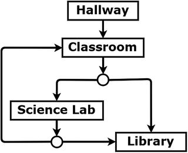

# Missing Homework Game

A student named Kelsoe Kismet has misplaced his homework somewhere in his school. The player chooses the locations where Kelsoe will search until he arrives at the location of the homework.

## School places game logic:

## Setup

- Java 8
- LigGDX 1.9.12: https://libgdx.badlogicgames.com
- Setup tool: https://github.com/tommyettinger/gdx-liftoff

## Disclaimer

This game is the result of reading, studying and learning the examples shown in the book "**Java Game Development with LibGDX**" by the author Lee Stemkoski.

- **Book site**: https://www.apress.com/gp/book/9781484233238
- **Source-code**: https://github.com/Apress/java-game-dev-LibGDX
